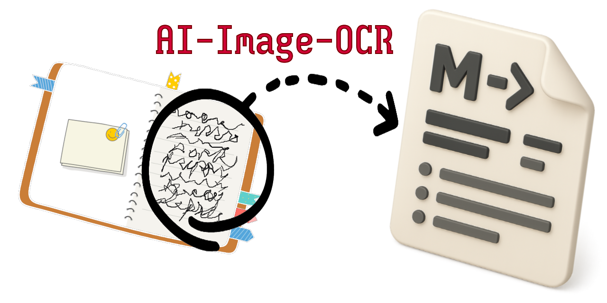

<!--
 Copyright (c) 2025 Chris Laprade (chris@rootiest.com)

 This software is released under the MIT License.
 https://opensource.org/licenses/MIT
-->

# AI Image OCR Plugin



A plugin for Obsidian that extracts text from images using
OCR powered by AI image recognition.

This is a simple plugin for extremely accurate and reliable
text and handwriting recognition in images.

AI models are vastly more effective at text extraction
compared to traditional tools such as Tesseract.

## Wiki

Visit the [Plugin Wiki](https://github.com/rootiest/obsidian-ai-image-ocr/wiki)
for detailed documentation.

## Supported Models

> [!TIP]
> The Google Gemini Flash 2.5 free tier (no credit card required)  
> has a rate limit of 250 RPD (requests per day).  
> Flash-Lite allows up to 1,000 RPD.  
> For most users, Gemini is the recommended model family  
> as it is fast, highly accurate, and free to use.

### OpenAI Models

#### GPT-4o (`gpt-4o`)

- A powerful model for text extraction
- Not free, but very inexpensive — see [Pricing](https://platform.openai.com/docs/pricing)
- Requires [OpenAI API key](https://platform.openai.com/settings/organization/api-keys)
- See [Notes](#notes) for API access requirements

#### GPT-4o Mini (`gpt-4o-mini`)

- Lower cost and latency than GPT-4o
- Slightly reduced accuracy
- Requires [OpenAI API key](https://platform.openai.com/settings/organization/api-keys)

#### GPT-4.1 (`gpt-4.1`)

- Successor to GPT-4, optimized for production use
- Requires GPT-4 API access and billing
- See [Pricing](https://platform.openai.com/docs/guides/gpt#model-overview)

#### GPT-4.1 Mini (`gpt-4.1-mini`)

- Lightweight version of GPT-4.1
- Faster and more affordable, with slightly reduced capabilities

#### GPT-4.1 Nano (`gpt-4.1-nano`)

- Extremely low-latency and low-cost version of GPT-4.1
- Suitable for fast, low-resource scenarios

---

### Google Gemini Models

#### Gemini 2.5 Flash (`gemini-2.5-flash`)

- A fast and efficient model for text extraction
- Free tier available with generous rate limits — see [Rate Limits](https://ai.google.dev/gemini-api/docs/rate-limits#current-rate-limits)
- Requires [Google API key](https://aistudio.google.com/apikey)

#### Gemini 2.5 Flash-Lite Preview (`gemini-2.5-flash-lite-preview-06-17`)

- Lightweight version of Gemini Flash
- Free tier with especially generous limits
- Useful for large volumes of low-latency OCR
- Requires [Google API key](https://aistudio.google.com/apikey)

#### Gemini 2.5 Pro (`gemini-2.5-pro`)

- Slower but extremely accurate model for OCR
- Requires paid tier access — see [Pricing](https://ai.google.dev/gemini-api/docs/pricing#gemini-2.5-pro)
- Requires [Google API key](https://aistudio.google.com/apikey)

---

### Local Models

#### Ollama

- Run models like `llava`, `llava:13b`, or `bakllava` entirely on your machine
- No internet required
- Must have [Ollama](https://ollama.com) installed and running

#### LM Studio

- Compatible with local models that support the OpenAI Chat Completions API
- Requires [LM Studio](https://lmstudio.ai) to be installed and running
- Works with any vision-capable model that accepts base64 image input

---

### Custom OpenAI-Compatible Providers

- Bring-your-own endpoint support for any service that follows the
  OpenAI-compatible Chat Completions API
- Allows integration with services like:

  - [DeepInfra](https://deepinfra.com)
  - [Fireworks.ai](https://fireworks.ai)
  - [Together.ai](https://together.ai)
  - [Groq](https://groq.com)
  - Custom self-hosted APIs

- Specify the full endpoint URL, model ID, and API key (if required)

> [!NOTE]
> Custom providers are untested.
> Successful use will depend on compatibility with the OpenAI API.
> User must enter the correct address and model ID.
> Where applicable a valid API key must also be provided.

## Features

- Extract text from images directly into your Obsidian notes
- Supports [multiple AI models](#supported-models) — cloud and local
- Use local models via Ollama or LM Studio (no API key or billing required)
- Add your own OpenAI-compatible provider and model ID
- Works with common image formats (PNG, JPG, WEBM, etc.)
- Clean, markdown-formatted output
- Use custom prompt text or stick with the default
- Choose where to send extracted text:
  - Replace image embed
  - Insert at cursor
  - Create or append to another note
- Header and footer template creation with `{{placeholder}}` support
- File/folder naming template creation with `{{placeholder}}` support
- Extract from embedded images or via OS-native file/folder pickers
- Built-in CORS proxy fallback for external images

> [!NOTE]
> Support for `{{placeholder}}` options is still being tested.
> Unexpected behavior may occur.  
> Refer to the
> [Wiki](https://github.com/rootiest/obsidian-ai-image-ocr/wiki/Templating)
> for available placeholders.
> Please report any placeholder issues or suggestions on GitHub.

## Installation

### Install via Obsidian Community Plugin Browser

> [!NOTE]
> This option is not yet available.

1. Open Obsidian settings.
2. Under "Community plugins", ensure "Safe mode" is disabled.
3. Click "Browse" to open the Community Plugin Browser.
4. Search for "AI Image OCR".
5. Click "Install" to download the plugin.

### Install via BRAT

If you have the [BRAT](https://github.com/TfTHacker/obsidian42-brat) plugin installed,
you can install this plugin using the BRAT plugin manager:

1. Open the BRAT plugin settings.
2. Click `Add beta plugin`.
3. Enter `https://github.com/rootiest/obsidian-ai-image-ocr`
   in the `Repository URL` field.
4. (Optionally) Check the `Enable after installing the plugin`
   checkbox to enable the plugin immediately after installation.
5. Click `Add plugin`

### Manual Installation

Clone this repository to your vault plugins directory:

```sh
git clone https://github.com/rootiest/obsidian-ai-image-ocr.git \
  .obsidian/plugins/obsidian-ai-image-ocr
```

Or download the [plugin archive](https://github.com/rootiest/obsidian-ai-image-ocr/archive/refs/heads/main.zip)
and extract to your plugins directory.

## Configuration

- Choose a model provider (`OpenAI`, `Gemini`, `Ollama`, etc.)
- Select a model ID (e.g. `gpt-4o`, `llava:13b`, etc.)
- If using a cloud model, enter the corresponding API key

Several addition optional configuration option are available with which
you may customize the output behavior.

`{{placeholder}}` options are
[detailed in the wiki](https://github.com/rootiest/obsidian-ai-image-ocr/wiki/Templating).

## Usage

### Open An Image For Extraction

1. Use the command palette (`Ctrl+P`) and search for "Extract text from image".
2. Select an image file.
3. Text will be extracted and inserted per your configuration.

### Extract Text From An Embedded Image

1. Place your cursor below the embedded image.
2. Use the "Extract Text from Embedded Image" command.
3. The nearest image above the cursor will be used as the source.
4. The embed will be replaced by the extracted text.

### Select A Folder For Extraction

1. Use the command palette (`Ctrl+P`) and search for
   "Extract text from image folder".
2. Select a directory which contains images.
3. Text will be extracted from each image and inserted per your configuration.

## Notes

> [!TIP]
> You can select an image embed in your note to use it as the source
> _and_ replace it with the extracted text.

> [!NOTE]
> When using OpenAI:  
> You must use a user or service account key (not a `sk-proj` key).

> [!WARNING]
> CORS security restrictions may prevent the plugin
> from collecting externally linked images.  
> A built-in proxy will attempt to fetch the image if direct access fails.  
> If the proxy fails, you may need to download the image manually.

---

## Requirements

- Internet connection (unless using a local model)
- For OpenAI/Gemini: API key
- For local models: Ollama or LM Studio installed and running

---

## 🚧 Roadmap

The following features are under consideration
for future releases of the plugin:

### Extend Placeholder Support

- Add `created`/`modified` placeholders for images.
  - Support  moment.js formatting of image placeholders.
- Add other `{{placeholder}}` options.

### Reverse Placeholder Support

- Support using a keyword to indicate where extracted text should be place in a note.

> [!NOTE]
> These goals are exploratory and may evolve based on user feedback and
> API capabilities. Have a suggestion? Open an issue or discussion on GitHub!

---

## License

[MIT](./LICENSE)

## Credits

- OpenAI GPT models
- Google Gemini models
- Ollama + open source vision models like LLaVA and BakLLaVA
- LM Studio and compatible OpenAI-like APIs
- Inspired by the limitations of traditional OCR (e.g., Tesseract)
- Built with ❤️ for Obsidian
